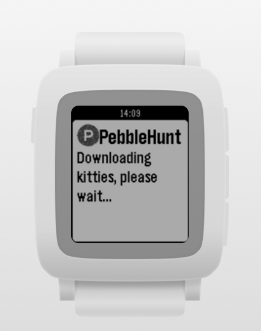

</a>
# pebblehunt
A simple ProductHunt reader for [Pebble](https://www.pebble.com/);

# Why
The main objective of this project was to test [pebblejs](http://github.com/pebble/pebblejs).

The App was code and copile using [Cloudpebble](https://cloudpebble.net/).

# Pebble App Store
Yes, the app is available on the Pebble APP store as [PHUNTFEED](https://apps.getpebble.com/applications/5648ba2982267d5caa00006c); please try it!

# License
[The MIT License (MIT)](LICENSE)
